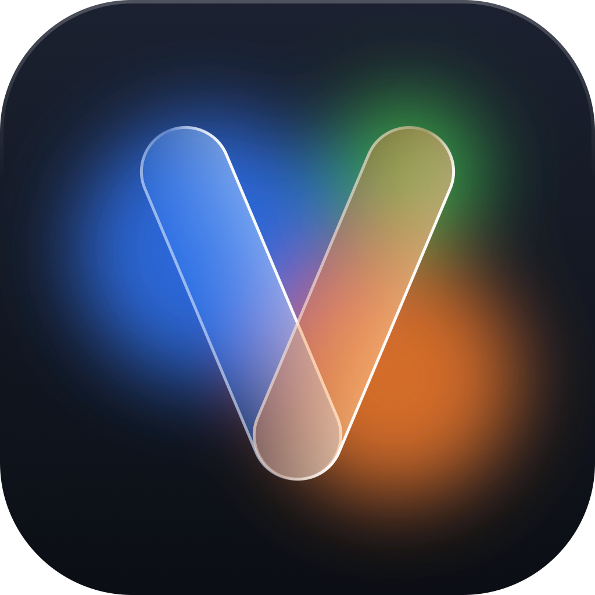
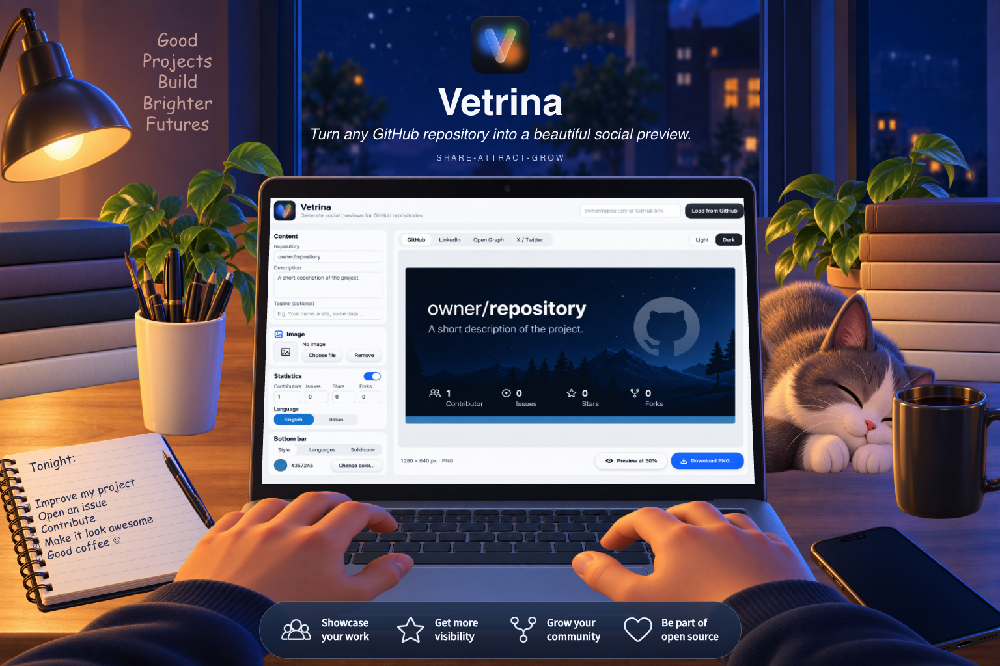
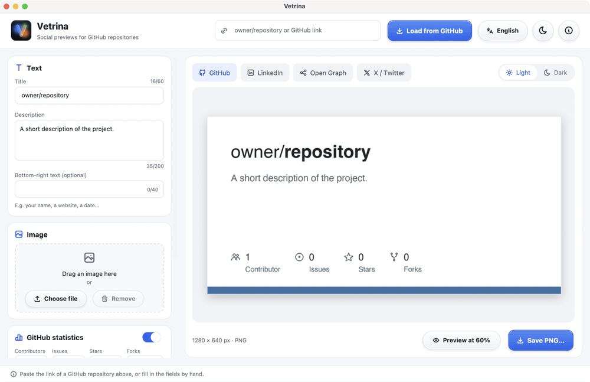
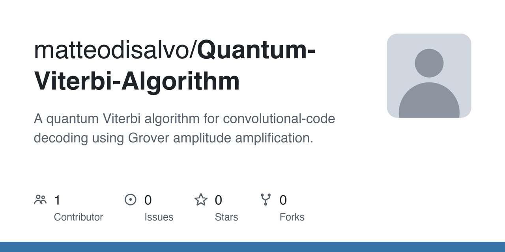

<p align="center">
  
</p>

<h1 align="center">Vetrina</h1>

<p align="center">
  Anteprime social per i tuoi repository GitHub, pronte in pochi secondi dal tuo computer.
</p>

<p align="center">
  <a href="https://github.com/matteodisalvo/vetrina/releases/latest"></a>
  <a href="https://github.com/matteodisalvo/vetrina/actions/workflows/tests.yml"></a>
  
  
  
  <a href="LICENSE"></a>
</p>

<p align="center"><a href="README.md">Read in English</a></p>

<p align="center">
  
</p>

## ✨ Cosa fa

Incolli il link di un repository pubblico e Vetrina compila la miniatura al posto tuo:
titolo, descrizione, collaboratori, issue, stelle, fork, i colori dei linguaggi e la foto
del proprietario. Cambi quello che vuoi, l'anteprima segue ogni modifica, e salvi un PNG.

<p align="center">
  
</p>

- **Le misure di ogni social**: GitHub (1280 × 640), LinkedIn (1200 × 627),
  Open Graph (1200 × 630) e X (1200 × 675).
- **Miniature chiare o scure**, con la barra in basso nei colori dei linguaggi del
  repository oppure in un colore a scelta.
- **La tua immagine**, scelta da un file o trascinata sulla finestra.
- **Anteprima a grandezza reale** prima di salvare; il PNG è disegnato al doppio della
  dimensione e poi ridotto, per bordi morbidi.
- **Parla cinque lingue**: italiano, inglese, spagnolo, francese e tedesco, in modalità chiara o scura.

<p align="center">
  
</p>

## 💡 Come nasce

Vetrina nasce da un'esigenza, come tutte le cose belle (e anche parecchie di quelle brutte).

Ogni volta che finivo un progetto andavo tutto fiero ad aggiungerlo al mio profilo
LinkedIn. Link incollato, descrizione limata, pubblica… e al posto dell'anteprima, il
nulla. Niente miniatura. Il progetto c'era, ma si presentava al colloquio in pigiama.

Almeno nel mio caso, la miniatura non si creava da sola, LinkedIn non aveva alcuna
intenzione di inventarsela, e io non avevo alcuna voglia di aprire un programma di grafica
ogni volta per allineare al pixel titolo, stelline e contatori.

Così ho fatto quello che fa ogni programmatore davanti a un compito noioso da cinque
minuti: ho passato parecchie serate a scrivere un programma che lo facesse al posto mio.
E visto che ormai c'era, ho pensato di renderlo disponibile a tutti. Se anche i tuoi
progetti escono di casa in pigiama, Vetrina serve a vestirli.

## 📦 Installazione

Scarica il file per il tuo sistema dall'[ultima versione](https://github.com/matteodisalvo/vetrina/releases/latest).

###  macOS

1. Scarica `Vetrina-<versione>-macOS.dmg` e aprilo.
2. Trascina **Vetrina** su **Applicazioni**.
3. La prima volta macOS potrebbe dire che non può verificare lo sviluppatore, perché l'app
   non è autenticata da Apple. Apri **Impostazioni di Sistema → Privacy e sicurezza**,
   scorri in basso e fai clic su **Apri comunque**. Basta farlo una volta.

L'immagine disco è per i Mac con Apple silicon (M1 e successivi). Su un Mac Intel,
[avvia Vetrina dal codice sorgente](#avviarla-dal-codice-sorgente).

###  Windows

1. Scarica `Vetrina-<versione>-Windows.exe`.
2. Fai doppio clic: non c'è niente da installare.
3. Se Windows SmartScreen avvisa che l'autore è sconosciuto, fai clic su **Ulteriori informazioni → Esegui comunque**.

### Avviarla dal codice sorgente

Su qualsiasi sistema con Python 3.10 o successivo e Tk:

```bash
git clone https://github.com/matteodisalvo/vetrina.git
cd vetrina
python3 -m pip install .
vetrina                 # oppure: python3 -m vetrina
```

## 🚀 Come si usa

1. Incolla in alto `proprietario/repository`, oppure il link di un repository, e premi **Carica da GitHub**.
2. Modifica titolo, descrizione, immagine o statistiche; l'anteprima segue ogni modifica.
3. Scegli formato e tema sopra l'anteprima, poi fai clic su **Salva PNG…** (⌘S su macOS, Ctrl+S su Windows).

Per usare la miniatura come anteprima del repository su GitHub, apri nel repository
**Settings → General → Social preview → Edit → Upload an image**.

## 🛠️ Sviluppo

```bash
python3 -m pip install -e ".[dev]"   # l'app, pytest e ruff
pytest                               # esegue i test
ruff check src tests                 # controlla lo stile
```

```
vetrina/
├── src/vetrina/
│   ├── model.py         # la miniatura: formati, temi, etichette, colori dei linguaggi
│   ├── rendering.py     # disegna la miniatura con Pillow
│   ├── github.py        # legge un repository dall'API di GitHub
│   ├── i18n.py          # tutti i testi della finestra, in ogni lingua
│   ├── settings.py      # ricorda la lingua e l'aspetto
│   ├── paths.py         # dove si trovano le risorse incluse
│   ├── assets/          # logo e font delle icone
│   └── ui/
│       ├── app.py       # la finestra principale
│       ├── widgets.py   # pulsanti di vetro, selettori, campi, area dell'immagine
│       ├── theme.py     # colori della finestra, chiari e scuri
│       ├── icons.py     # icone da un font di icone
│       └── imaging.py   # funzioni sulle immagini per la finestra
├── tests/               # i test (pytest)
├── packaging/           # ricetta di PyInstaller, script di build e icone dell'app
└── .github/workflows/   # test a ogni push, app a ogni release
```

Il disegno, la lettura da GitHub e le traduzioni non dipendono dalla finestra, quindi si
possono collaudare anche senza uno schermo.

### Costruire le app

```bash
python3 -m pip install -e ".[build]"   # aggiunge PyInstaller
bash packaging/build-macos.sh          # su un Mac: dist/Vetrina-<versione>-macOS.dmg
```

Su Windows, esegui `packaging\build-windows.ps1` in PowerShell per ottenere
`dist\Vetrina-<versione>-Windows.exe`. PyInstaller costruisce per il sistema su cui gira,
quindi ogni app si costruisce sul proprio sistema.

### Pubblicare una versione

Le app da scaricare non stanno nel repository: le costruisce GitHub e le allega a una
release, la pagina **Releases** del repository. Per pubblicare una nuova versione:

1. Scrivi il nuovo numero di versione in `pyproject.toml` e in `src/vetrina/__init__.py`
   (i nomi dei file delle app lo prendono da qui) e annota le novità in `CHANGELOG.md`.
2. Fai commit e carica un tag con lo stesso numero preceduto da `v`:

```bash
git tag v<versione>
git push origin v<versione>
```

GitHub costruisce l'app per macOS e quella per Windows e crea la release con i due file
allegati. Dal tab **Actions** puoi anche avviare il workflow **Release** a mano: costruisce
le app come prova, senza pubblicare nulla.

## 🌍 Traduzioni

Tutti i testi sono in [`src/vetrina/i18n.py`](src/vetrina/i18n.py), ciascuno con le sue
cinque lingue affiancate. Per aggiungere una lingua, aggiungi il suo codice a `LANGUAGES`
e un testo a ogni voce; i test controllano che non manchi nessun testo e che ogni
traduzione inserisca gli stessi valori. Le correzioni di chi è madrelingua sono benvenute.

## 🙏 Crediti

- Icone di [Tabler Icons](https://tabler.io/icons), licenza MIT
  (vedi [la sua licenza](src/vetrina/assets/fonts/LICENSE-tabler-icons.txt)).
- Fatta con [CustomTkinter](https://github.com/TomSchimansky/CustomTkinter),
  [Pillow](https://python-pillow.org) e [tkinterdnd2](https://github.com/Eliav2/tkinterdnd2).
- Dati dei repository dall'[API REST di GitHub](https://docs.github.com/en/rest).

## 📄 Licenza

[MIT](LICENSE) © 2026 Matteo Di Salvo

Creata da **Matteo Di Salvo**: [GitHub](https://github.com/matteodisalvo) ·
[sito web](https://matteodisalvo.github.io/)

## ☕ Offrimi un caffè

Se Vetrina ti ha risparmiato qualche anteprima vuota e vuoi ringraziarmi, puoi offrirmi
un caffè:

<p align="center">
  <a href="https://buymeacoffee.com/matteodisalvo"></a>
</p>
